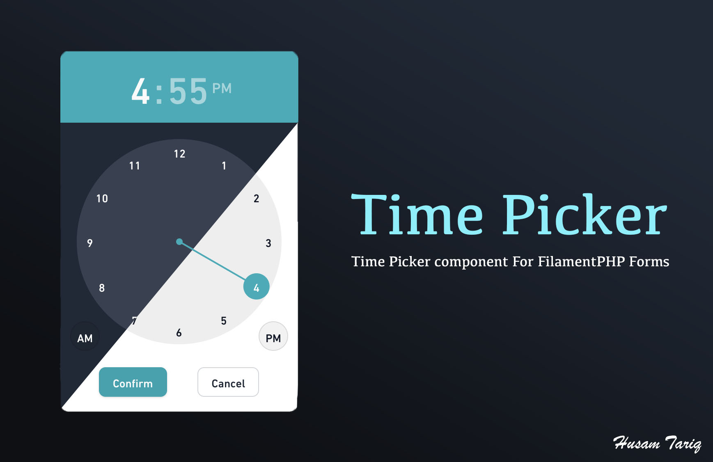

# Filament Time Picker

[](https://packagist.org/packages/eslam-reda-div/timepicker-fork-for-filament-v5)




## Installation

You can install the package via composer:

```bash
composer require eslam-reda-div/timepicker-fork-for-filament-v5
```


Optionally, you can publish the views using

```bash
php artisan vendor:publish --tag="filament-timepicker-views"
```


## Usage

```php
use EslamRedaDiv\FilamentTimePicker\Forms\Components\TimePickerField;

TimePickerField::make('from_hour')->label('time')->okLabel("Confirm")->cancelLabel("Cancel"),
```

## Testing

```bash
composer test
```

## Changelog

Please see [CHANGELOG](CHANGELOG.md) for more information on what has changed recently.

## Contributing

Please see [CONTRIBUTING](.github/CONTRIBUTING.md) for details.

## Security Vulnerabilities

Please review [our security policy](../../security/policy) on how to report security vulnerabilities.

## Credits

- [Hussam Tariq](https://github.com/husam-tariq)
- [All Contributors](../../contributors)

## License

The MIT License (MIT). Please see [License File](LICENSE.md) for more information.
